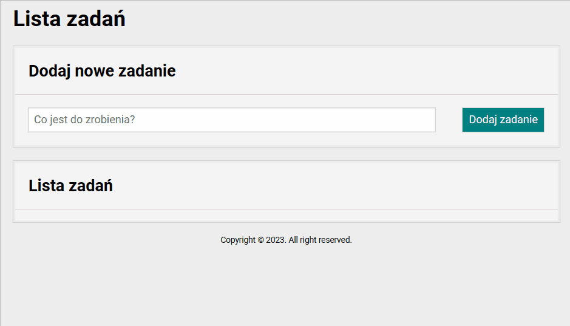

# To-do-list
A to-do list is a tool used to organize and prioritize tasks and activities that need to be completed within a specific timeframe. It serves as a reminder and a roadmap to help individuals stay focused and productive.
In the following list you enter one by one all the tasks that appear and are added up below the input field. You can mark each task as done, hide done tasks, delete a single task/tasks or start the whole list from the beginning by resetting and deleting all the tasks you have done so far, as per below short demonstration:

## Demo
https://aleksandra-nie.github.io/To-do-list-v3/
## Tools
- HTML
- CSS
- JavaScript
- BEM convention
- Normalize
## Features
- Responsive on both website and mobile phone
- Bem convention was added due to easier code review
